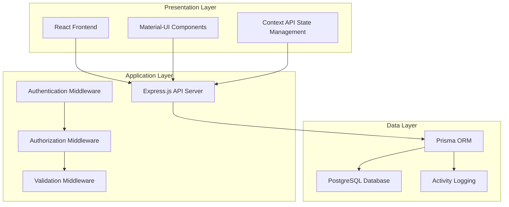
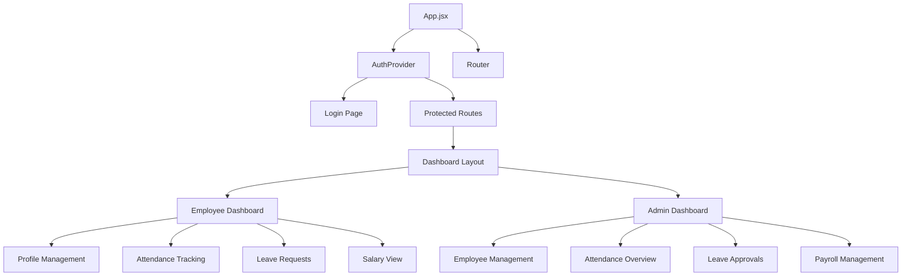
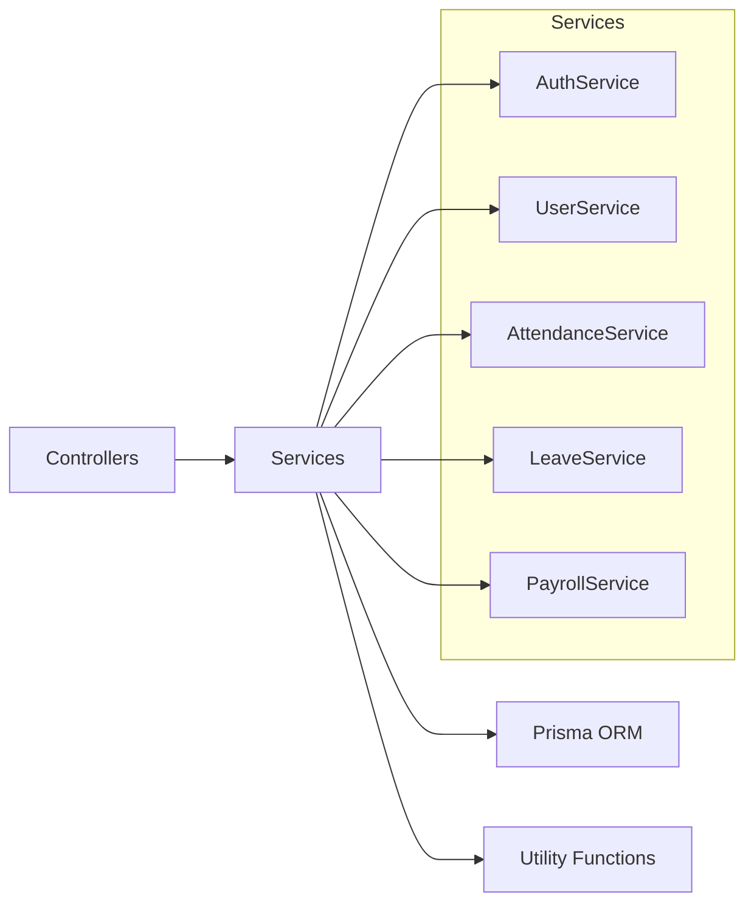
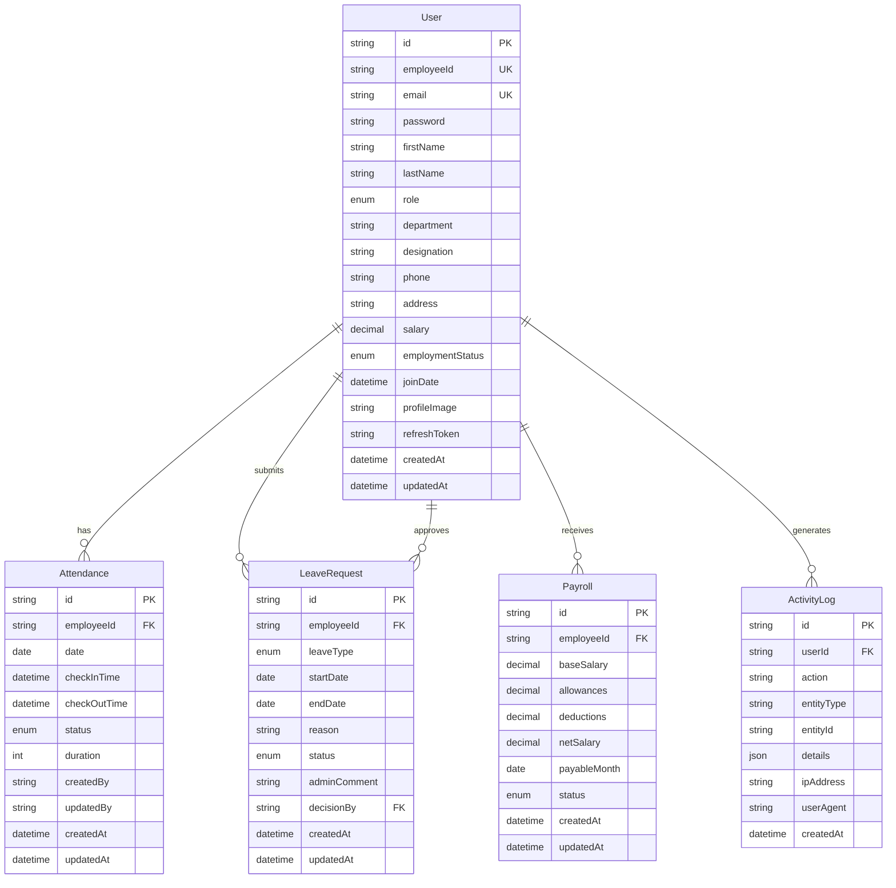

# Design Document

## Overview

Dayflow HRMS is designed as a modern, scalable Human Resource Management System using a RESTful API architecture with a React frontend and Node.js backend. The system follows a layered architecture pattern with clear separation of concerns, implementing role-based access control and comprehensive HR functionality including employee management, attendance tracking, leave management, and payroll processing.

## Architecture

### System Architecture Pattern

The system follows a **3-tier layered architecture** with the following layers:



### Technology Stack

**Frontend:**
- React 18 with functional components and hooks
- Material-UI (MUI) for consistent design system
- React Router for client-side routing
- Context API for state management
- Vite for build tooling and development server

**Backend:**
- Node.js with Express.js framework
- Prisma ORM for database operations
- JWT for authentication and authorization
- bcrypt for password hashing
- express-validator for input validation

**Database:**
- PostgreSQL for primary data storage
- Prisma migrations for schema management
- Structured logging for audit trails

## Components and Interfaces

### Frontend Components Architecture



### Backend API Structure

The API follows RESTful conventions with the following endpoint structure:

```
/api
├── /auth
│   ├── POST /login
│   ├── POST /signup
│   ├── POST /refresh
│   └── POST /logout
├── /users
│   ├── GET /me
│   ├── PUT /me
│   ├── GET /
│   ├── POST /
│   ├── GET /:id
│   └── PUT /:id
├── /attendance
│   ├── POST /checkin
│   ├── POST /checkout
│   ├── GET /me
│   └── GET /
├── /leave
│   ├── POST /
│   ├── GET /me
│   ├── GET /
│   └── PUT /:id/status
├── /payroll
│   ├── GET /me
│   ├── GET /
│   ├── POST /
│   └── PUT /:id
└── /dashboard
    ├── GET /admin
    └── GET /employee
```

### Service Layer Architecture



## Data Models

### Core Entity Relationships



### Data Validation Rules

**User Model:**
- Email must be unique and valid format
- Password minimum 8 characters with complexity requirements
- Employee ID must be unique and 3-50 characters
- Names must be 2-50 characters
- Role must be ADMIN, HR, or EMPLOYEE
- Employment status: ACTIVE, INACTIVE, TERMINATED, ON_LEAVE

**Attendance Model:**
- Unique constraint on employeeId + date
- Check-in time must be before check-out time
- Duration calculated in minutes
- Status: PRESENT, ABSENT, HALF_DAY, LEAVE

**Leave Request Model:**
- Start date must be before or equal to end date
- Leave type: PAID, SICK, UNPAID, CASUAL, EMERGENCY
- Status: PENDING, APPROVED, REJECTED, CANCELLED

**Payroll Model:**
- Net salary = base salary + allowances - deductions
- Unique constraint on employeeId + payableMonth
- Status: PENDING, PROCESSED, PAID

## Error Handling

### Error Response Format

All API errors follow a consistent format:

```json
{
  "success": false,
  "message": "Human-readable error message",
  "error": "Error code or type",
  "details": "Additional error details (development only)"
}
```

### Error Categories

1. **Authentication Errors (401)**
   - Invalid credentials
   - Expired tokens
   - Missing authentication

2. **Authorization Errors (403)**
   - Insufficient permissions
   - Terminated account access

3. **Validation Errors (400)**
   - Invalid input format
   - Missing required fields
   - Business rule violations

4. **Not Found Errors (404)**
   - Resource not found
   - Invalid endpoints

5. **Conflict Errors (409)**
   - Duplicate entries
   - Constraint violations

6. **Server Errors (500)**
   - Database connection issues
   - Unexpected system errors

## Testing Strategy

### Unit Testing Approach

The testing strategy implements both unit tests and property-based tests for comprehensive coverage:

**Unit Tests:**
- Test specific examples and edge cases
- Verify integration points between components
- Test error conditions and boundary values
- Focus on critical business logic validation

**Property-Based Tests:**
- Verify universal properties across all inputs
- Test with randomized data generation
- Ensure system behavior consistency
- Validate correctness properties from requirements

### Testing Framework Configuration

- **Frontend**: Jest + React Testing Library
- **Backend**: Jest + Supertest for API testing
- **Property Testing**: fast-check library for JavaScript
- **Database**: In-memory SQLite for test isolation
- **Coverage**: Minimum 80% code coverage requirement

### Test Organization

```
tests/
├── unit/
│   ├── services/
│   ├── controllers/
│   ├── middleware/
│   └── utils/
├── integration/
│   ├── auth.test.js
│   ├── attendance.test.js
│   ├── leave.test.js
│   └── payroll.test.js
└── properties/
    ├── auth.properties.test.js
    ├── attendance.properties.test.js
    ├── leave.properties.test.js
    └── payroll.properties.test.js
```

Each property-based test must:
- Run minimum 100 iterations per property
- Reference the corresponding design document property
- Use tag format: **Feature: dayflow-hrms, Property {number}: {property_text}**

## Correctness Properties

*A property is a characteristic or behavior that should hold true across all valid executions of a system-essentially, a formal statement about what the system should do. Properties serve as the bridge between human-readable specifications and machine-verifiable correctness guarantees.*

### Authentication and Security Properties

**Property 1: Authentication Token Generation**
*For any* valid user credentials (email and password), authentication should generate valid access and refresh tokens with appropriate expiration times
**Validates: Requirements 1.1**

**Property 2: Invalid Credentials Rejection**
*For any* invalid credentials (wrong email, wrong password, or malformed input), the authentication system should reject the attempt with appropriate error messages
**Validates: Requirements 1.2**

**Property 3: Password Security**
*For any* password stored in the system, it should be hashed using bcrypt with minimum 12 salt rounds and never stored in plain text
**Validates: Requirements 1.3**

**Property 4: Email Uniqueness**
*For any* user registration attempt, if the email already exists in the system, the registration should be rejected with a conflict error
**Validates: Requirements 1.4**

**Property 5: Role-Based Access Control**
*For any* API request to protected resources, access should be granted only if the user's role has the required permissions for that resource
**Validates: Requirements 1.5, 2.3, 2.4, 6.6, 7.1, 7.4**

**Property 6: Token Lifecycle Management**
*For any* authentication token, expired tokens should be rejected, and refresh tokens should be invalidated upon logout
**Validates: Requirements 1.6, 1.7**

### User Interface and Dashboard Properties

**Property 7: Role-Appropriate Dashboard Content**
*For any* user login, the dashboard should display content and navigation options appropriate to their role (employee vs admin/HR)
**Validates: Requirements 2.1, 2.2, 2.5**

**Property 8: Responsive Design**
*For any* screen size or device type, the user interface should adapt appropriately and maintain usability
**Validates: Requirements 8.2**

**Property 9: Form Validation Feedback**
*For any* form input that fails validation, immediate feedback should be provided to the user with specific error messages
**Validates: Requirements 8.4**

### Employee Profile Management Properties

**Property 10: Profile Data Access**
*For any* employee accessing their profile, all profile information should be displayed, and only authorized fields should be editable based on user role
**Validates: Requirements 3.1, 3.2, 3.3**

**Property 11: Input Validation and Sanitization**
*For any* user input across the system, invalid data should be rejected with appropriate validation messages, and valid data should be sanitized before storage
**Validates: Requirements 3.4, 7.2**

**Property 12: Employment Status Access Control**
*For any* user whose employment status changes to TERMINATED, their system access should be immediately revoked
**Validates: Requirements 3.5**

**Property 13: Audit Trail Logging**
*For any* significant system action (profile changes, approvals, administrative actions), a complete audit log entry should be created with user, action, and timestamp details
**Validates: Requirements 3.6, 7.3**

### Attendance Management Properties

**Property 14: Attendance Recording**
*For any* check-in or check-out action, the system should record accurate timestamps and calculate duration correctly for check-out events
**Validates: Requirements 4.1, 4.2**

**Property 15: Attendance Business Rules**
*For any* attendance operation, the system should enforce business rules: no duplicate check-ins per date, and check-out required before next day check-in
**Validates: Requirements 4.3, 4.4**

**Property 16: Attendance Status Calculation**
*For any* attendance record, the status (PRESENT, ABSENT, HALF_DAY, LEAVE) should be calculated correctly based on check-in/out times and duration
**Validates: Requirements 4.5**

**Property 17: Attendance Data Access and Aggregation**
*For any* attendance query, employees should see only their own data with proper summaries, while admins should see all employee data with filtering capabilities
**Validates: Requirements 4.6, 4.7**

### Leave Management Properties

**Property 18: Leave Request Creation**
*For any* leave request submission, all required fields (type, date range, reason) should be captured and the status should be set to PENDING
**Validates: Requirements 5.1, 5.3**

**Property 19: Leave Type Validation**
*For any* leave request, only valid leave types (PAID, SICK, UNPAID, CASUAL, EMERGENCY) should be accepted
**Validates: Requirements 5.2**

**Property 20: Leave Approval Workflow**
*For any* leave request review by authorized personnel, status changes and comments should be properly recorded and notifications should be triggered
**Validates: Requirements 5.4, 5.5**

**Property 21: Leave Conflict Prevention**
*For any* leave request with dates that overlap existing approved leave for the same employee, the request should be rejected
**Validates: Requirements 5.6**

**Property 22: Leave History Maintenance**
*For any* leave request, regardless of status, it should be permanently stored and retrievable for historical reporting
**Validates: Requirements 5.7**

### Payroll Management Properties

**Property 23: Payroll Data Access Control**
*For any* payroll data request, employees should have read-only access to their own data, while admins should have full edit access to all employee payroll data
**Validates: Requirements 6.1, 6.2**

**Property 24: Automatic Salary Calculation**
*For any* change to base salary, allowances, or deductions, the net salary should be automatically recalculated as: base + allowances - deductions
**Validates: Requirements 6.3**

**Property 25: Payroll History and Status Management**
*For any* payroll record, it should be maintained by month with appropriate status tracking (PENDING, PROCESSED, PAID)
**Validates: Requirements 6.4, 6.5**

### System Security and Performance Properties

**Property 26: Rate Limiting Protection**
*For any* user making excessive requests, the system should implement rate limiting to prevent abuse while allowing normal usage
**Validates: Requirements 7.6**

**Property 27: Navigation and Accessibility**
*For any* user interaction, navigation between modules should work correctly and basic accessibility features should be available
**Validates: Requirements 8.3, 8.5**

### Analytics and Reporting Properties

**Property 28: Dashboard Analytics Accuracy**
*For any* dashboard request, statistics (employee counts, attendance summaries, leave statistics, payroll insights) should be calculated accurately from current data
**Validates: Requirements 9.1, 9.2, 9.5**

**Property 29: Report Filtering Functionality**
*For any* report generation request, filtering by date range, department, and employee should return only matching records
**Validates: Requirements 9.3**

**Property 30: Activity Feed Display**
*For any* administrative dashboard access, recent system activities should be displayed in chronological order with relevant details
**Validates: Requirements 9.4**

### Data Integrity Properties

**Property 31: Database Consistency**
*For any* database operation, referential integrity constraints should be maintained and transactions should be atomic
**Validates: Requirements 10.3**

**Property 32: Error Handling Quality**
*For any* system error, user-friendly error messages should be provided without exposing sensitive system information
**Validates: Requirements 10.4**